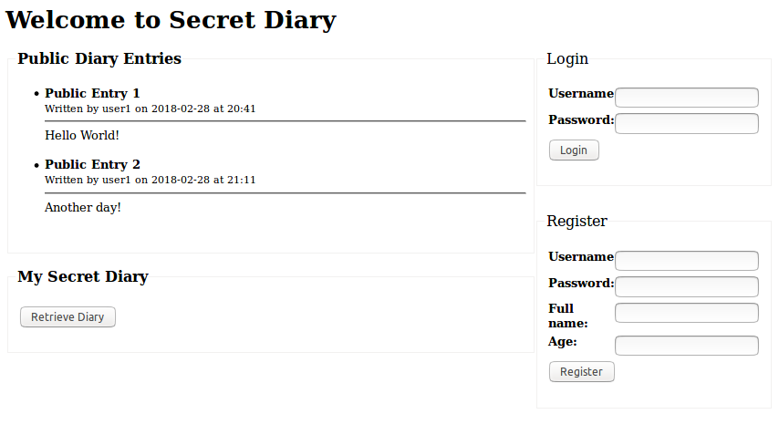

# rest-api-development

CS5331 Assignment 1 Project Reference Repository

## Instructions

Your objective is to implement a web application that provides the endpoints
specified here: https://cs5331-assignments.github.io/rest-api-development/.

The project has been packaged in an easy to set-up docker container with the
skeleton code implemented in Python Flask. You are not restricted in terms of
which language, web stack, or database you desire to use. However, please note
that very limited support can be given to those who decide to veer off the
beaten path.

You may be required to modify the following files/directories:

- Dockerfile - contains the environment setup scripts to ensure a homogenous
  development environment
- src/ - contains the front-end code in `html` and the skeleton Flask API code
  in `service`
- img/ - contains images used for this README

Assuming you're developing on an Ubuntu 16.04 machine, the quick instructions
to get up and running are:

```
# Install Docker

sudo apt-get update
sudo apt-get install \
    apt-transport-https \
    ca-certificates \
    curl \
    software-properties-common
curl -fsSL https://download.docker.com/linux/ubuntu/gpg | sudo apt-key add -
sudo add-apt-repository \
   "deb [arch=amd64] https://download.docker.com/linux/ubuntu \
   $(lsb_release -cs) \
   stable"
sudo apt-get update
sudo apt-get install docker-ce

# Verify Docker Works

sudo docker run hello-world

# Run the skeleton implementation

sudo ./run.sh
```

(Docker CE installation instructions are from this
[link](https://docs.docker.com/install/linux/docker-ce/ubuntu/#install-using-the-repository).)

**Please consult your assignment hand-out for detailed setup information.**

## Grading

The implementation will be graded in an automated fashion on an Ubuntu 16.04
virtual machine by building the docker container found in your repository and
running it. The grading script will interact with your API.

The following ports are expected to be accessible:

1. 80, on which static HTML content, including the front-end, is served.
2. 8080, on which the API is exposed.

To verify this, please run the following commands:

```
sudo ./run.sh
```

On a different window:

```
curl http://localhost:80
curl http://localhost:8080
```

If a response is received, you're good to go.

**Please replace the details below with information relevant to your team.**

## Screenshots

Please replace the example screenshots with screenshots of your completed
project. Feel free to include more than one.



## Administration and Evaluation

Please fill out this section with details relevant to your team.

### Team Members

1. Eldric Lim
2. Joshua Che
3. Chan Jian Hui
4. Derek Kok

### Short Answer Questions

#### Question 1: Briefly describe the web technology stack used in your implementation.

Answer: Python Flask for the web application, sqlite3 for the backend-database. We chose sqlite3 as it is light-weight and easy to use with Python Flask.

#### Question 2: Are there any security considerations your team thought about?

Answer: Yes, we initially made a user's token "" (empty string) when expired. This allowed requests to be authenticated by simply passing an empty string in a http request. We proceeded to change it to NULL instead.

#### Question 3: Are there any improvements you would make to the API specification to improve the security of the web application?

Answer: Make it https-compliant, have more parameters like nonces or timeouts for things like requests or tokens, etc.

#### Question 4: Are there any additional features you would like to highlight?

Answer: None.

#### Question 5: Is your web application vulnerable? If yes, how and why? If not, what measures did you take to secure it?

Answer: 
Yes. Certain malformed requests may cause errors/exceptions in the server that will make it return a HTTP 500 error. Some errors were caught, but not all of them. 

No steps were taken to prevent SQL injection vulnerabilities either. 

As stated in question 2, our application initially allowed blank tokens, which could authenticate a request when a blank token is used, but we fixed this by using NULL instead.

#### Feedback: Is there any other feedback you would like to give?

Answer: None.

### Declaration

#### Please declare your individual contributions to the assignment:

1. Eldric Lim
    - API
    - Front-end
2. Joshua Che
    - API
    - Front-end
3. Chan Jian Hui
    - API
    - Front-end
4. Derek Kok
    - API
    - Front-end

